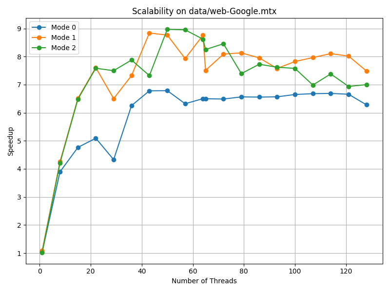
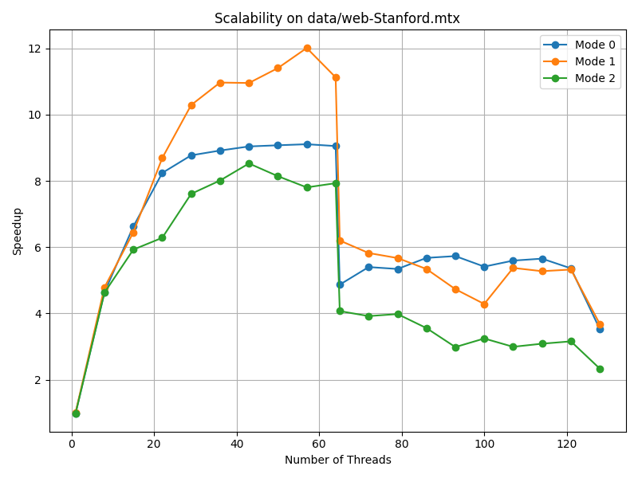
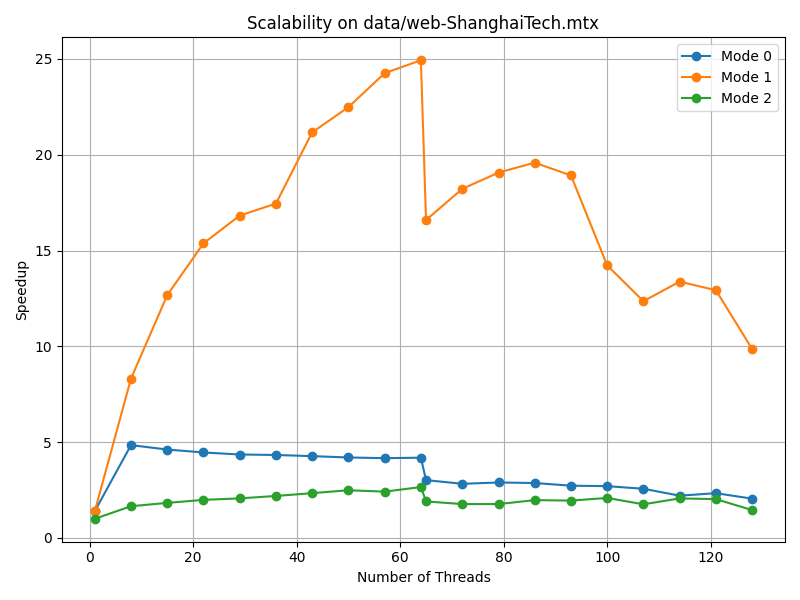
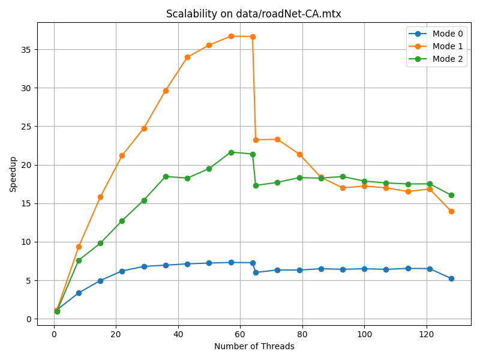
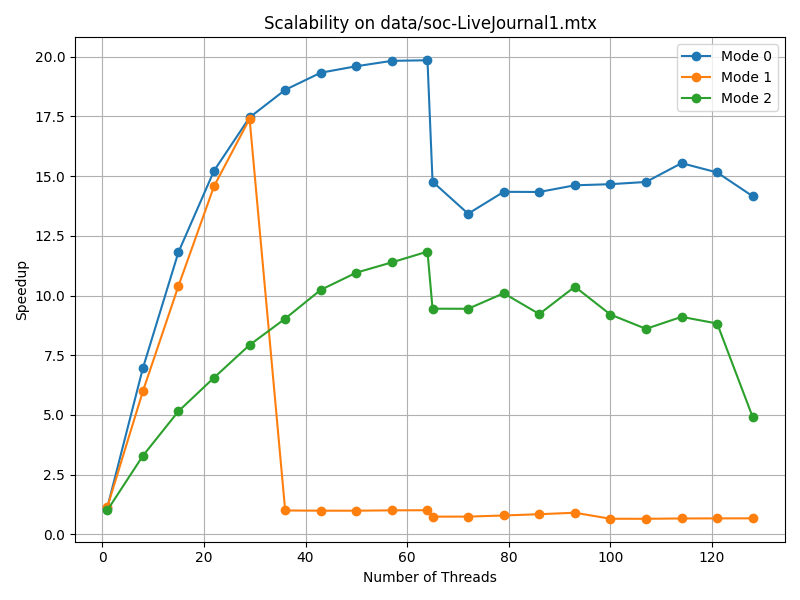
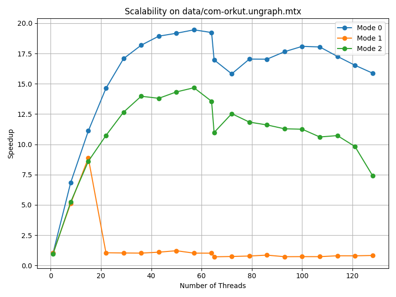

# PageRank

## 1. Introduction

The PageRank algorithm, famously introduced by Larry Page and Sergey Brin, revolutionized information retrieval by
shifting the focus of search engines from simple keyword matching and term frequency toward a more global notion of
importance. Instead of treating web pages as isolated documents, PageRank models the entire Web as a directed graph and
evaluates authority through link structure.

It operates on the Random Surfer model, which assumes that a user repeatedly follows hyperlinks with some probability
and occasionally jumps to a random page. Under this interpretation, the PageRank value of a page corresponds to the
long-term probability that the surfer visits it. The core intuition is recursive and self-reinforcing: a page is
important if it is referenced by other important pages.

This project explores the parallelization of PageRank using OpenMP on shared-memory systems. In particular, we compare
three different parallelization strategies, each making different trade-offs between load balancing, synchronization
overhead, and algorithmic efficiency on modern multi-core architectures.

## 2. Mathematical Model

### 2.1 The PageRank Formula

The PageRank value $PR(u)$ for a node $u$ is defined as:

$$PR^{(t+1)}(u) = \frac{1-d}{N} + \frac{d \sum_{k \in D} PR^{(t)}(k)}{N} + d \sum_{v \in In(u)} \frac{w_{v,u} \cdot PR^{(t)}(v)}{\sum_{z \in Out(v)} w_{v,z}}$$

Where:

- $N$: The total number of nodes in the graph.
- $d$: The damping factor (often set to $0.85$), representing the probability that a surfer follows a link.
- $D$: The set of **Dangling Nodes** (nodes with no outgoing edges, i.e., $Out(u) = \emptyset$).
- $In(u)$: The set of nodes that point *to* $u$ (in-neighbors).
- $Out(u)$: The set of nodes that begins from *to* $u$ (out-neighbors).
- $w_{v,u}$: The weight of the edge from $v$ to $u$.

### 2.2 Data Layout

In this project, the graph is represented using the Compressed Sparse Row (CSR) format, which stores adjacency
information compactly and allows efficient traversal of edges. The choice of traversal strategy—whether iterating over
sources or destinations—has a significant impact on memory access patterns, synchronization requirements, and overall
parallel performance.

**1. Push (Source-Centric)**

This model iterates over source nodes $u$ using the standard CSR graph (out-edges). For each neighbor $v$, it adds the
calculated contribution to `pr_new[v]`.

- **Pros:** The algorithm is straightforward to implement and maps naturally to the mathematical definition. It also
  allows reductions to be expressed directly over edges.
- **Cons:** The algorithm writes to random memory locations (`pr_new[v]`). In a parallel environment, multiple threads
  may attempt to update the same destination node concurrently, requiring atomic operations or locks. These operations
  serialize execution and significantly degrade scalability.

**2. Pull (Destination-Centric)**

This model iterates over destination nodes $u$. It gathers contributions from all incoming neighbors $v$ by traversing
the **Transpose Graph** (`converse`).

- **Pros:** Each thread writes exclusively to its own `pr_new[u]`, resulting in sequential, conflict-free writes. Since
  no two threads update the same element, no atomics or locks are required. This property makes the Pull model
  inherently parallel-friendly.
- **Cons:** While writes are well-behaved, the reads from `pr_normalized[v]` are effectively random, which may lead to
  cache misses and reduced memory locality.

Despite the cost of irregular reads, the Pull model’s lock-free nature makes it a better choice for parallel PageRank on
shared-memory systems. All implementations in this project are therefore based on the Pull paradigm.

---

## 3. Implementation

I implemented three variations of the parallel PageRank algorithm to investigate the trade-offs between load balancing,
scheduling overhead, and algorithmic efficiency.

### 3.1 Implementation I: `pagerank_omp.c`

Real-world graphs often exhibit Power-Law degree distributions, where a small number of hub nodes have extremely high
degree while the majority of nodes have very few edges. Under such conditions, a naive static partitioning strategy (
assigning $N/P$ nodes per thread) leads to severe load imbalance.
To avoid this issue, I introduced OpenMP’s dynamic scheduling. This allows threads that finish early to continue
processing additional nodes, improving overall utilization.

Through empirical testing, a chunk size of 64 was found to provide the best trade-off:

- Chunk too small: excessive scheduling overhead.
- Chunk too large: insufficient responsiveness to highly skewed degree distributions.

**Optimization:**

In a naive implementation, the contribution would be calculated directly as `w * pr[v] * damping / out_w[v]` inside the
inner loop. Since `v` represents a neighbor index, accessing both `pr[v]` and `out_w[v]` would trigger two separate
random memory accesses (cache misses). So I introduced a pre-calculation loop for `pr_normalized`.

#### Code Analysis

```c
#pragma omp parallel
{
// Pre-calculate normalized values to avoid a random memory access
// Also collect the dangling nodes
#pragma omp for schedule(static) reduction(+: dangling_sum)
  for (int i = 0; i < n; ++i) {
    if (out_w[i] != 0) {
      pr_normalized[i] = pr[i] * damping / (double) out_w[i];
    } else {
      dangling_sum += pr[i];
    }
  }

#pragma omp single
  base_score = (1.0 - damping + damping * dangling_sum) / n;

#pragma omp for schedule(dynamic, 64) reduction(+: diff)
  for (int u = 0; u < n; ++u) {
    double sum = base_score;
    const int start = converse->offset[u], end = converse->offset[u + 1];
    for (int i = start; i < end; ++i) {
      const int v = converse->m[i].v;
      const int w = converse->m[i].w;
      // Here we have one random memory access (bottleneck)
      sum += w * pr_normalized[v];
    }
    pr_new[u] = sum;
    diff += fabs(sum - pr[u]);
  }
}
```

- **Pros:** Robust against highly skewed degree distributions (like `web-ShanghaiTech`). It is easy to implement using
  standard OpenMP clauses.
- **Cons:** **High Overhead.** For graphs with low average degrees (like `roadNet-CA`, where avg degree $\approx 2.5$),
  the computation inside the inner loop is trivial. The overhead of the OpenMP runtime managing the dynamic queue
  becomes a dominant factor, limiting the maximum speedup.

### 3.2 Implementation II: `pagerank_omp_balanced`

To overcome the overhead of dynamic scheduling while maintaining load balance, I implemented a static partitioning
strategy based on edge counts rather than node counts.

The goal is to define thread boundaries such that every thread processes exactly $|E| / P$ edges. Since the graph is
stored in CSR format, the `offset` array is monotonic. We can use binary search (`lower_bound`) to find the exact node
indices that divide the edge array into equal segments.

#### Code Analysis

**Partitioning:**

```c
// Calculate partition boundaries based on edge counts
int *start_v = malloc(sizeof(int) * (num_threads + 1));
start_v[num_threads] = n;
#pragma omp parallel for schedule(static)
for (int i = 0; i < num_threads; i++) {
  // Find the node index where the cumulative edge count reaches i * (total_edges / threads)
  start_v[i] = lower_bound(converse->offset, 0, n + 1, i * e / num_threads);
}
```

Inside the parallel region, each thread queries its ID (`tid`) and retrieves its pre-calculated range
`[start_v[tid], start_v[tid + 1])`.

```c
// Distribute the nodes
#pragma omp parallel reduction(+: diff)
{
  const int tid = omp_get_thread_num();
  const int end_v = start_v[tid + 1];
  for (int u = start_v[tid]; u < end_v; u++) {
    // ... (standard Pull logic) ...
  }
}
```

- **Pros:**

  1. **Less Scheduling Overhead:** The cost for scheduling is lower. This is a massive advantage for low-degree graphs (
     `roadNet`) where the dynamic scheduler was a bottleneck.
  2. **Theoretical Load Balance:** Every thread performs almost exactly the same number of memory reads and
     floating-point additions.
  3. **Cache Locality:** Threads process contiguous blocks of memory.

- **Cons:**

  Lack of flexibility. It cannot adapt to system noise or background processes.
  Also, on modern CPUs with Hybrid Architectures (e.g., Intel P-cores vs. E-cores or ARM big.LITTLE), this approach
  suffers.

  Also, although the workload is theoretically evenly distributed, due to factors such as processor architecture, some
  cores may exhibit severe slowdown (see the performance analysis section below for details).

### 3.3 Implementation III: `pagerank_omp_approx`

The standard PageRank algorithm updates *every* node in every iteration. However, as the algorithm progresses, many
nodes converge quickly and their values stop changing. Updating these stable nodes wastes memory bandwidth. The third
implementation introduces an **approximation** by keeping an active list.

We maintain a list of active nodes (`frontier`). A node is added to the next iteration's frontier only if its PageRank
value changed significantly ($|\Delta PR| > \epsilon$) in the current iteration.

By skipping updates for stable nodes, we introduce a **cumulative approximation error**. The final PageRank scores will
not be numerically identical to the exact eigenvector solution. However, for most practical applications, the exact
probability value is less important than the relative ranking of the nodes. While the absolute values fluctuate
slightly, the ordering of the top-ranked nodes remains somehow consistent with the exact version.

#### Code Analysis

**The Frontier Logic:**

```c
// 1. Compute updates only for nodes in current 'frontier'
#pragma omp parallel for schedule(static)
for (int i = 0; i < frontier_size; i++) {
  const int u = frontier[i];
  // ... compute sum ...
  pr_new[u] = sum;
  // Mark if this node needs to be active next time
  next_idx_prefix[i] = fabs(sum - pr[u]) > eps; 
}

// 2. Parallel Prefix Sum to calculate write positions
omp_prefix_sum(next_idx_prefix, frontier_size, prefix_block_sum);

// 3. Scatter
#pragma omp parallel for schedule(static)
for (int i = 0; i < frontier_size; i++) {
  const int prev_val = (i == 0) ? 0 : next_idx_prefix[i - 1];
  if (next_idx_prefix[i] > prev_val) {
    next_frontier[next_idx_prefix[i] - 1] = frontier[i];
  }
}
```

- **Pros:**
  The workload decreases exponentially, for both serial and parallel algorithms.
- **Cons:**
  1. **Overhead:** The parallel prefix sum and array compaction add overhead. In practice, the speedup and scalability
     of the parallelized algorithm isn't that good.
  2. **Complexity:** Requires managing explicit frontier arrays and implementing parallel scan primitives.

---

## 4. Performance

The following experiments were conducted on:

```
AMD EPYC 7742 64-Core Processor (2250 MHz, 128 Threads, 2 NUMA Nodes)
Ubuntu 22.04.5 LTS (x86_64)
GCC 11.4.0
OpenMP 201511
```

| Graph                      |  Nodes  |   Edges   | Average Degree |
|:---------------------------|:-------:|:---------:|:---------------|
| data/web-Google.mtx        | 875713  |  5105039  | 5.83           |
| data/web-Stanford.mtx      | 281903  |  2312497  | 8.20           |
| data/web-ShanghaiTech.mtx  | 108676  |  4879773  | 44.90          |
| data/roadNet-CA.mtx        | 1965206 |  2766607  | 1.41           |
| data/soc-LiveJournal1.mtx  | 4847571 | 68993773  | 14.23          |
| data/com-orkut.ungraph.mtx | 3072441 | 117185083 | 38.14          |

(`web-ShanghaiTech` is a dataset I crawled myself, starting from https://sist.shanghaitech.edu.cn. Code can be found in
`spider.py`)

#### Strategy 1

| Graph                      | Serial Time | 1 Thread Time | Threads Number | Parallel Time | Speedup | Scalability |
|:---------------------------|:-----------:|:-------------:|:--------------:|:-------------:|:-------:|:-----------:|
| data/web-Google.mtx        |    1.35     |     1.30      |       50       |     0.20      |  6.79   |    6.57     |
| data/web-Stanford.mtx      |    0.39     |     0.39      |       57       |     0.04      |  9.11   |    9.22     |
| data/web-ShanghaiTech.mtx  |    0.45     |     0.32      |       8        |     0.09      |  4.84   |    3.48     |
| data/roadNet-CA.mtx        |    1.48     |     1.29      |       57       |     0.20      |  7.31   |    6.38     |
| data/soc-LiveJournal1.mtx  |    18.68    |     16.64     |       64       |     0.94      |  19.85  |    17.68    |
| data/com-orkut.ungraph.mtx |    9.16     |     8.73      |       57       |     0.47      |  19.45  |    18.56    |

#### Strategy 2

| Graph                      | Serial Time | 1 Thread Time | Threads Number | Parallel Time | Speedup | Scalability |
|:---------------------------|:-----------:|:-------------:|:--------------:|:-------------:|:-------:|:-----------:|
| data/web-Google.mtx        |    1.36     |     1.25      |       43       |     0.15      |  8.84   |    8.14     |
| data/web-Stanford.mtx      |    0.39     |     0.38      |       57       |     0.03      |  12.01  |    11.84    |
| data/web-ShanghaiTech.mtx  |    0.45     |     0.32      |       64       |     0.02      |  24.93  |    18.03    |
| data/roadNet-CA.mtx        |    1.46     |     1.30      |       57       |     0.04      |  36.70  |    32.69    |
| data/soc-LiveJournal1.mtx  |    18.85    |     16.49     |       29       |     1.08      |  17.40  |    15.23    |
| data/com-orkut.ungraph.mtx |    9.08     |     8.69      |       15       |     1.02      |  8.87   |    8.48     |

#### Strategy 3

| Graph                      | Serial Time | 1 Thread Time | Threads Number | Parallel Time | Speedup | Scalability |
|:---------------------------|:-----------:|:-------------:|:--------------:|:-------------:|:-------:|:-----------:|
| data/web-Google.mtx        |    0.31     |     0.30      |       50       |     0.03      |  8.97   |    8.79     |
| data/web-Stanford.mtx      |    0.10     |     0.10      |       43       |     0.01      |  8.53   |    8.62     |
| data/web-ShanghaiTech.mtx  |    0.19     |     0.19      |       64       |     0.07      |  2.65   |    2.67     |
| data/roadNet-CA.mtx        |    0.25     |     0.25      |       57       |     0.01      |  21.64  |    22.31    |
| data/soc-LiveJournal1.mtx  |    1.72     |     1.70      |       64       |     0.15      |  11.84  |    11.73    |
| data/com-orkut.ungraph.mtx |    2.30     |     2.38      |       57       |     0.16      |  14.67  |    15.13    |

#### Figures








### Analysis of Results

The performance data reveals a distinct trade-off between scheduling overhead and memory access latency.

For `roadNet-CA` and `web-ShanghaiTech`, **Strategy 2 (Edge-Balanced)** demonstrates dominant performance.

- On **`roadNet-CA`**, Strategy 2 achieves a **36.7x speedup**, significantly outperforming Strategy 1 (7.3x). This
  graph has a very low average degree (1.41). The computational load per node is so small that the runtime overhead of
  the dynamic scheduler in Strategy 1 becomes the bottleneck.
- On **`web-ShanghaiTech`**, Strategy 2 achieves **24.9x speedup** vs Strategy 1's 4.8x. This confirms that static job
  distribution effectively neutralizes the load imbalance caused by "hub" nodes in Power-Law graphs (Since almost all
  pages would connect to the homepage), which node-based dynamic scheduling failed to handle efficiently.

However, a significant performance degradation is observed for Strategy 2 on large-scale social networks like *
*`com-orkut`** and **`soc-LiveJournal1`** (Check the figures below).
Strategy 2 relies on static partitioning. Threads are assigned fixed ranges of the graph.
Some threads inevitably process data located on a different NUMA node (or CPU die).
Accessing the remote memory from different cores requires traversing the CPU interconnect bus, which incurs high
latency.

Therefore, the entire system must wait for the slowest threads (those suffering from remote memory latency) to finish.
Strategy 1 (Dynamic), conversely, masks this latency. If one thread stalls waiting for memory, other threads continue
fetching chunks from the dynamic queue, keeping the execution units busy and saturating the memory bandwidth more
evenly.

**Strategy 3** consistently yields the lowest execution times by algorithmically reducing the workload. It is
particularly effective on `roadNet-CA`, where the large diameter of the graph means many nodes stabilize quickly,
allowing the "frontier" logic to skip the vast majority of the graph in later iterations.

### Conclusion

Overall, Strategy 2 proves to be highly suitable for Web Graph PageRank computations. Real-world web graphs (e.g.,
`web-ShanghaiTech`, `web-Stanford`) inherently exhibit a Power-Law distribution with significant degree skew, where a
few
nodes possess millions of links. Strategy 2's mechanism is practically ideal for this topology, as it effectively
neutralizes the workload imbalance caused by "super-nodes" without the runtime cost of dynamic scheduling.

---

## 5. Related Work

The parallelization of PageRank is a well-studied field, with various frameworks addressing the challenges of irregular
graph processing.

*Ligra: A Lightweight Graph Processing Framework for Shared Memory* introduced an adaptive strategy for graph traversal.
It dynamically switches between a sparse method (processing only active nodes) and a dense method (iterating over all
destinations) based on the size of the active frontier. This hybrid approach allows the system to optimize memory
bandwidth and computation for both sparse and dense phases of the algorithm.

GPU Acceleration: Implementations on GPUs (e.g., using CUDA) exploit massive parallelism. However, they face performance
challenges such as "warp divergence" and uncoalesced memory access due to the irregular structure of graph data.

MapReduce: Google’s original implementation utilized the MapReduce framework to handle web-scale graphs that exceed the
memory capacity of a single machine. This distributed approach focuses on fault tolerance and scalability across
clusters, though it introduces significant network communication overhead compared to shared-memory solutions.

---

## 6. Conclusion

This project demonstrated that efficient parallelization of PageRank requires analyzing the trade-offs between load
balancing, scheduling overhead, and algorithmic efficiency. We showed that Dynamic Scheduling adapts to skewed degree
distributions, while Manual Edge-Balancing tries to minimize overhead for exact results, and Approximation significantly
improves speed by skipping redundant computations. Therefore, achieving optimal performance on shared-memory systems
requires selecting the specific strategy based on the graph scenarios, balancing strict precision against computational
speed.
